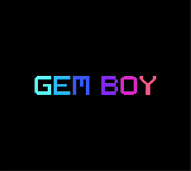

# Gemboy, a Game Boy emulator written in Ruby

[](https://gitlab.com/abk/emu-gb/-/jobs/artifacts/main/file/coverage/index.html?job=test)

Gemboy is a Game Boy emulator written in Ruby, covering both the DMG-01 (original model) and
the Game Boy Color. It runs `.gb` and `.gbc` ROMs: SM83 CPU, memory banking, scanline-accurate
graphics in monochrome or color, 4-channel stereo sound and battery saves.

Because C was too reasonable.

<p align="center">
  
  <br>
  <sub><code>test_roms/homemade/gemboy_logo.asm</code> &mdash; a Game Boy Color ROM written for this project</sub>
</p>

## Features

- **Models**: DMG-01 and Game Boy Color, picked from the cartridge header (`--cgb` forces color on a dual-compatible ROM)
- **CPU**: full SM83 instruction set, interrupts, `HALT`/`STOP`, per-instruction cycle counts, CGB double speed (`KEY1`)
- **Cartridges**: ROM only, MBC1, MBC3 and MBC5, with `.sav` persistence for battery-backed games
- **Real time clock**: MBC3 clock driven by emulated cycles, catching up the powered-off delay from the `.sav` timestamp
- **Graphics**: background, window and sprites, dot-level rendering with the real PPU mode cycle; in CGB, the two VRAM banks, per-tile attributes, the 8+8 RGB555 palettes and GDMA/HDMA transfers
- **Sound**: the four channels, stereo panning and master volume
- **Input**: the eight buttons, mapped to the keyboard (no gamepad support yet)
- **Debug Web UI**: optional web UI showing the PPU and APU internals, activated with `--debug-server`
- **Accuracy**: passes Blargg's `cpu_instrs` suite and `dmg-acid2` (pixel-level check)

## Prerequisites

- Ruby 3.3+
- SDL2 and SDL2_ttf:
  - **macOS**: `brew install sdl2 sdl2_ttf`
  - **Linux**: `apt install libsdl2-dev libsdl2-ttf-dev`

If the libraries live somewhere unusual, point `GEMBOY_SDL_DIR` at the directory holding them.

## Installation

```bash
git clone https://github.com/kaderate/gemboy.git
cd gemboy
bundle install
bundle exec rspec   # optional, verifies the setup
```

## Running

```bash
bin/gemboy path/to/rom.gb
bin/gemboy --cgb path/to/rom.gbc    # force color on a ROM that also supports DMG
```

On macOS, omitting the path opens a file picker.

The model comes from the cartridge's CGB flag: a CGB-only ROM always runs in color, a
DMG-only ROM always in monochrome, and a dual-compatible one runs in DMG mode unless `--cgb`
is passed.

Battery-backed games write their save next to the ROM as a `.sav` file, on exit and on every cartridge RAM write.

## Debug UI

```bash
bin/gemboy --debug-server path/to/rom.gb        # then open http://127.0.0.1:4000
bin/gemboy --debug-server=8080 path/to/rom.gb   # on another port
```

The emulator serves a small page over server-sent events, sampled at frame boundaries:

- **PPU** — decoded tile data, both tilemaps, and a sprite layer rendering what OAM actually holds
- **APU** — channel-level, with envelope, length timer and period divider, the wave RAM,
  and a scope buffer of the mixed and per-channel samples

It costs nothing when the flag is absent (no probe instantiated).

### Input mapping

| Game Boy | Keyboard |
|---|---|
| D-Pad | Arrow keys |
| A | Z |
| B | X |
| Start | Enter |
| Select | Space |

## Development

```bash
bundle exec rspec                                          # test suite
bundle exec rspec --tag accuracy                           # reference ROMs, kept out of the default run (~40s)
bundle exec rubocop                                        # linter
ruby test_roms/run_test.rb <rom.gb> <out.png>              # one test ROM, headless + screenshot
ruby test_roms/run_all.rb                                  # HTML report over every suite
```

`test_roms/` holds the reference suites (Blargg, dmg-acid2, cgb-acid2, rtc3test). They run headless
and report either through the serial port, by exporting the final framebuffer as a PNG, or by
comparing that framebuffer to a reference image.

`debug/` holds throwaway-style scripts built on `HeadlessEmulator`, which runs a ROM without SDL and
replays a scripted sequence of button presses:

```bash
ruby debug/rom_info.rb roms                                # cartridge header of every ROM in a dir
ruby debug/debug_rtc3test.rb sub_second 90 limiter         # one rtc3test suite, screenshotted
ruby debug/debug_zelda_pause_crash.rb                      # a reproduction script kept as an example
```

See [ARCHITECTURE.md](ARCHITECTURE.md) for how the emulator is built, the design decisions
behind it, and performance notes.

## References

- [Pan Docs](https://gbdev.io/pandocs/) — Game Boy technical reference
- [CPU opcode list](https://izik1.github.io/gbops/)
- [Blargg's test ROMs](https://github.com/retrio/gb-test-roms)
- [dmg-acid2](https://github.com/mattcurrie/dmg-acid2) — PPU rendering test
- [cgb-acid2](https://github.com/mattcurrie/cgb-acid2) — CGB PPU rendering test
- [rtc3test](https://github.com/aaaaaa123456789/rtc3test) — MBC3 real time clock test
- [GBEmulatorShootout](https://gbdev.io/GBEmulatorShootout/) — accuracy comparison across emulators

## License

MIT, see [LICENSE](LICENSE). The bundled Inter font is under the SIL Open Font License, see
[assets/fonts/LICENSE-Inter.txt](assets/fonts/LICENSE-Inter.txt).

## Contributing

Contributions are welcome! Feel free to:
- Open issues for bugs or feature requests
- Submit pull requests with improvements
- Share ideas for optimization or compatibility enhancements

Please ensure tests pass before submitting PRs:
```bash
bundle exec rspec
```
